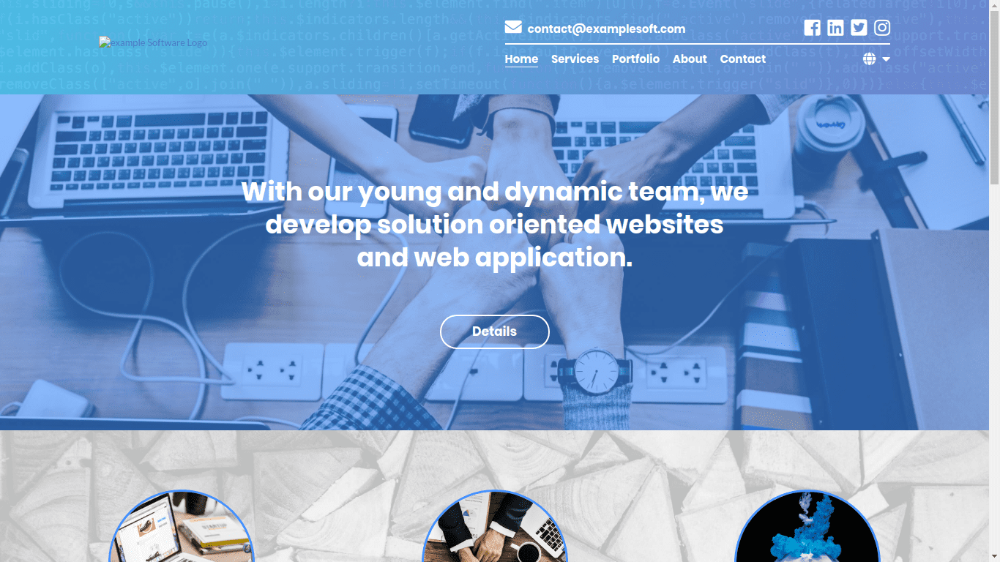

# Example Company Website



This is full-stack application that uses [this html template](https://github.com/19XLR95/example-company-website-template-1).

It is responsive and has i18n (EN & TR) support. *Services* page doesn't work, you should set database config in *.env* file. The project have built with PHP and [Laravel](https://laravel.com/).

To run the project:
Copy *.env.example* file in the same location and rename it as *.env* then run the following commands.
```
composer install
php artisan key:generate
php artisan serve
```
To send email via *contact* page you should set mail config in *.env* file.
